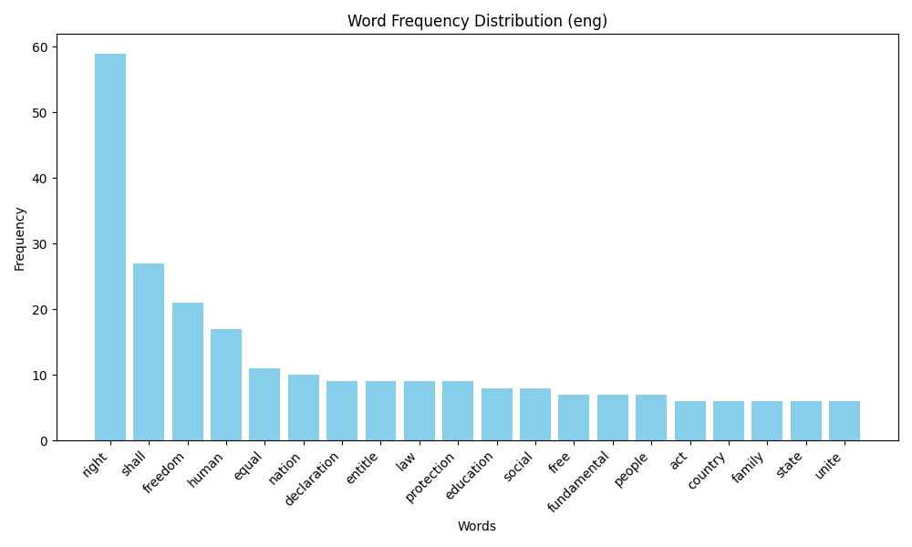
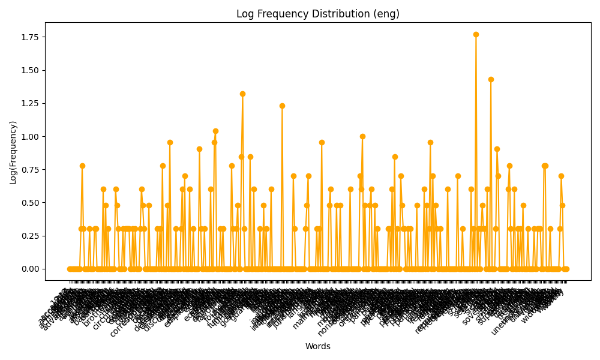
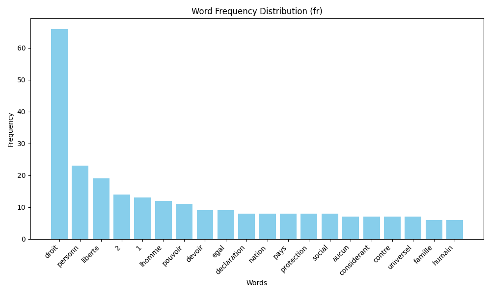
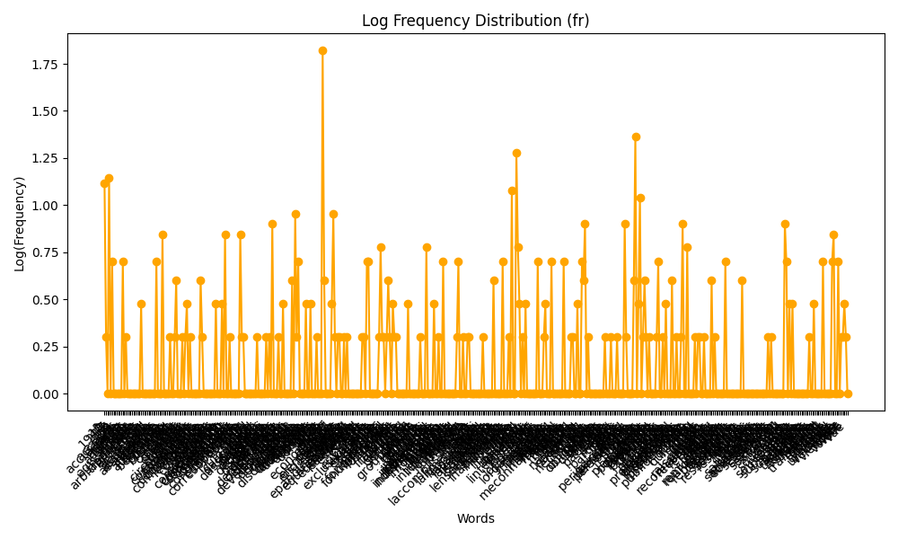
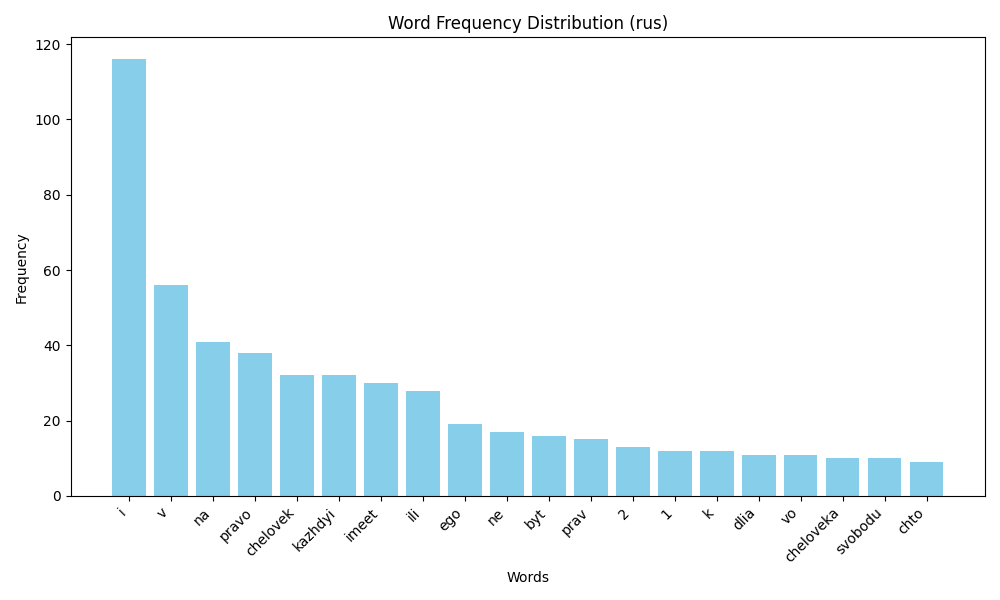
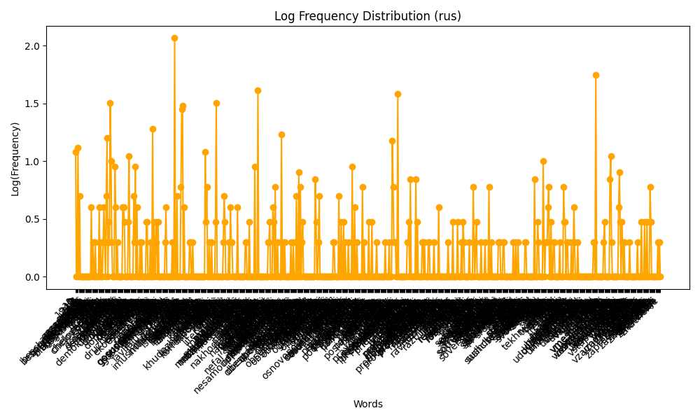
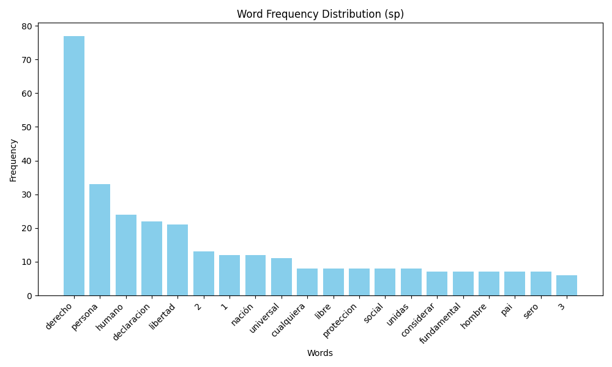
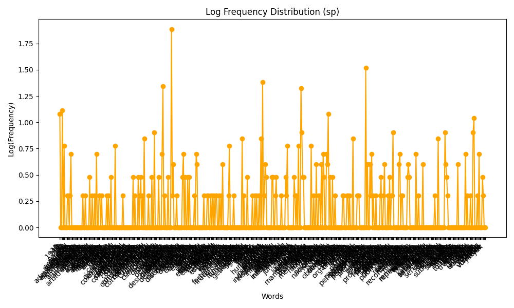

# Lab: Word Frequency Analysis Across Multiple Languages

## Overview
This project focuses on analyzing word frequency distributions across four languages: **English, French, Russian, and Spanish**. The primary objective is to process text data, clean it, lemmatize words, and perform frequency analysis to investigate patterns such as **Zipf’s law**.

## Goal
The goal of this project is to:
- **Preprocess** multilingual text data (cleaning, tokenization, lemmatization).
- **Convert** raw text into structured formats (CSV) for easier analysis.
- **Organize** and normalize the data.
- **Perform word frequency analysis** and compare distributions across languages.
- **Interpret results** in relation to linguistic properties and Zipf’s law.

## Folder Structure
```
├── data/
│   ├── originals/            # Original text files
│   ├── cleaned/             # Preprocessed text files
│   ├── text_csv/            # Converted text in CSV format
│   ├── organized_text/      # Structured text data
│   ├── lemmatized_text/     # Lemmatized text
├── scripts/
│   ├── text_processing.py   # Cleans text files
│   ├── txt_to_csv.py        # Converts text to CSV
│   ├── organize_text.py     # Organizes structured text
│   ├── lemmatize_text.py    # Lemmatizes words in text
│   ├── frequency_analysis.py # Performs frequency analysis
├── output_analysis/         # Final frequency distributions and graphs
```

## Scripts & Outputs
| Script                 | Output Folder       | Description |
|------------------------|--------------------|-------------|
| `text_processing.py`   | `data/cleaned/`    | Cleans text: removes punctuation, lowercases words, removes stopwords. |
| `txt_to_csv.py`        | `data/text_csv/`   | Converts text files into CSV format for structured processing. |
| `organize_text.py`     | `data/organized_text/` | Organizes text into structured format, grouping by language and word category. |
| `lemmatize_text.py`    | `data/lemmatized_text/` | Applies lemmatization to normalize words and reduce variations. |
| `frequency_analysis.py`| `output_analysis/` | Computes word frequency distributions and visualizes Zipf’s law trends. |

## Results & Interpretation
- **Word frequency distributions** reveal high-frequency words across different languages.
- **Zipf’s law** holds across all four languages, with a steep frequency decline after the most common words.
- **Linguistic differences** impact the shape of distributions due to grammatical structures (e.g., inflection in Russian, articles in French and Spanish).

### Frequency Graphs
Below are the frequency distribution and log-frequency graphs for each language:

#### English



#### French



#### Russian



#### Spanish



## Conclusion
This project demonstrates the universality of Zipf’s law while highlighting language-specific variations in word frequency distributions. The insights from this experiment can be extended to NLP applications such as text compression, language modeling, and linguistic research.